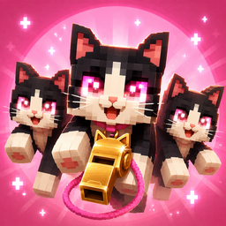
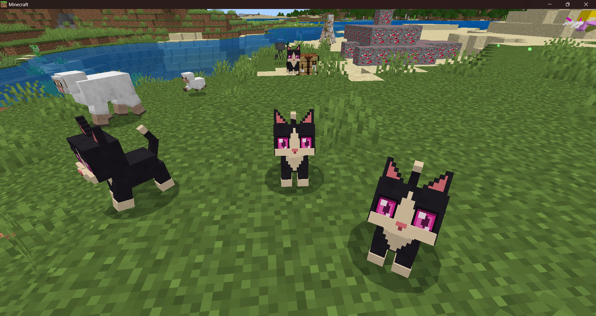
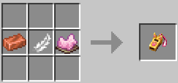
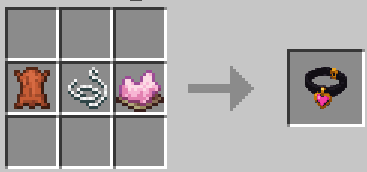
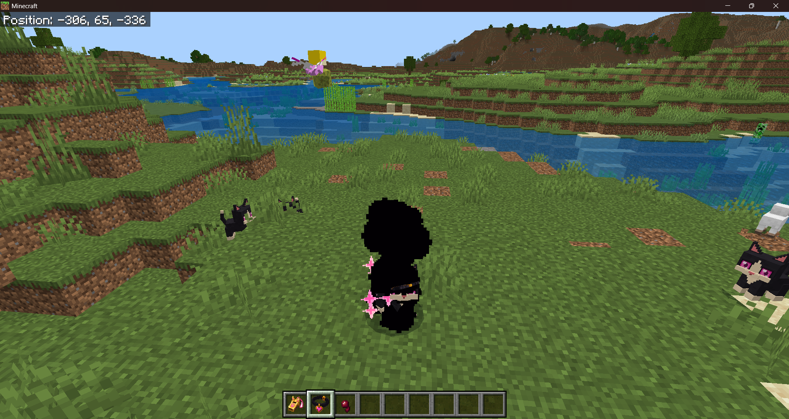
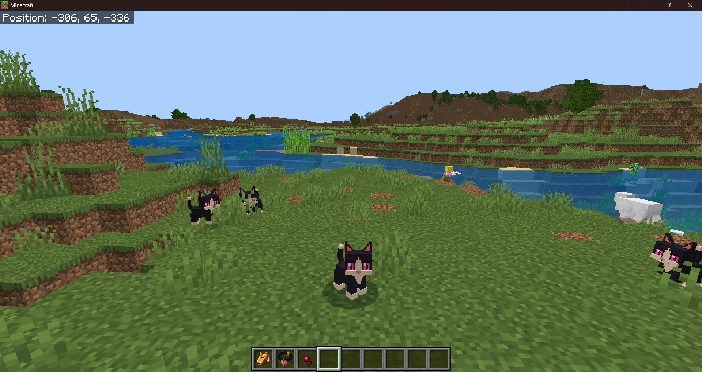
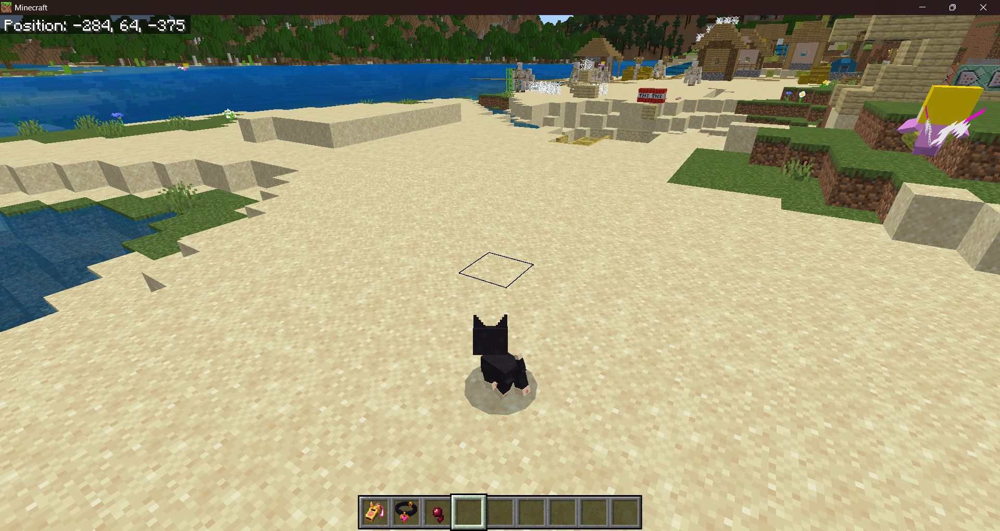

<p align="center">
  
</p>

<h1 align="center">Kitty Army</h1>

<p align="center">
  Call a magical army of pink-eyed tuxedo kitties—or wear their collar and
  become one yourself—in Minecraft Bedrock Edition.
</p>

<p align="center">
  <strong>Bedrock 1.26.45+</strong> · <strong>20-kitty army</strong> ·
  <strong>No experimental toggles</strong>
</p>

<p align="center">
  <a href="https://github.com/lukeBussnick/minecraft-bedrock-kitty-army/releases/latest"><strong>Download the latest Kitty Army.mcaddon</strong></a>
</p>



## What it adds

- **Kitty Whistle** — call up to 20 friendly tuxedo kitties in four sparkling waves
- **Kitty Transformation Collar** — transform your player directly into the same custom kitty
- Pink sparkle effects and a custom whistle sound
- Owner-specific armies that follow, fight monsters, and remain independent in multiplayer
- Outward dismissal routes with invisible per-kitty waypoints and pink particle cleanup
- A custom 35-cube model, 256×256 texture, and dedicated walk/run animations

The v1.6.5 release has been player-tested in Minecraft Bedrock. The transformation and outward dismissal behavior shown here are runtime results, while the automated tests cover pack integrity and lifecycle logic.

## Recipes

<table>
  <tr>
    <th align="center">✨ Kitty Whistle</th>
    <th align="center">💗 Kitty Transformation Collar</th>
  </tr>
  <tr>
    <td align="center"></td>
    <td align="center"></td>
  </tr>
  <tr>
    <td align="center"><strong>Copper Ingot + Feather + Pink Dye</strong></td>
    <td align="center"><strong>Leather + String + Pink Dye</strong></td>
  </tr>
</table>

Both recipes are shapeless, so the ingredients can be placed anywhere in the crafting grid.

## Become the kitty

Equip the **Kitty Transformation Collar** in the head armor slot. The real player remains fully controllable, keeping normal movement, collision, reach, inventory, health, interactions, and camera behavior while the resource pack renders the custom kitty form.

<table>
  <tr>
    <th align="center">Transformation effect</th>
    <th align="center">Completed kitty form</th>
  </tr>
  <tr>
    <td align="center"></td>
    <td align="center"></td>
  </tr>
</table>

The forward transformation takes about 0.6 seconds and uses a dark compression effect followed by pink sparkles. Removing or replacing the collar restores the player's original appearance.



## Call the army

Use the **Kitty Whistle** once to summon the army. Kitties arrive around the player on loaded walkable terrain, follow their owner, and attack nearby monsters. Use the whistle again to send them home.

Each departing kitty receives its own invisible outward waypoint. Native pathfinding carries it toward that destination without scripted pushing, teleporting, or forced jumping. The planner checks dry support, clearance, hazards, one-block steps, and alternate side routes before extending the waypoint. Kitties disappear with a pink sparkle after reaching the departure distance.

## Commands

```mcfunction
/give @s kittie:kittie_whistle
/give @s kittie:kittie_collar
/function give_whistle
/function give_collar
```

The historical `kittie:*` namespace is intentionally preserved for compatibility with existing worlds and inventories.

## Installation

1. Download `Kitty Army.mcaddon` from the latest GitHub release.
2. Open the file with Minecraft Bedrock Edition.
3. Activate **Kitty Army Behavior Pack** on a world. The linked Resource Pack should activate automatically.
4. Fully leave and reopen the world after updating an existing installation.

No experimental toggles are required.

## Building from source

Requirements:

- Minecraft Bedrock Edition 1.26.45 or newer
- PowerShell 7 or Windows PowerShell 5.1
- Node.js for JavaScript syntax and lifecycle tests
- Python 3 with Pillow for image validation and optional art regeneration

Validate and package:

```powershell
.\validate.bat
.\package.bat
```

The installable is created at `dist/Kitty Army.mcaddon` and verified against the editable source files inside the archive.

For local development deployment, run `sync-to-minecraft.bat` while Minecraft is at the main menu. The script validates first, backs up the existing scoped targets, replaces only `KittieArmy_BP` and `KittieArmy_RP`, and verifies source/live SHA-256 hashes.

## Project structure

- `behavior_pack/` — items, recipes, kitty AI, waypoint entity, and Script API lifecycle logic
- `resource_pack/` — custom model, textures, animations, particles, sound, player rendering, and localization
- `source_art/` — editable ImageGen sources and deterministic asset-building tools
- `tests/` — army lifecycle, outward-route, and player-transformation regression suites
- `tools/` — validation, packaging, route-definition generation, and scoped deployment scripts
- `docs/` — runtime screenshots, recipe captures, and release documentation

The editable behavior and resource packs are authoritative. Generated packages, deployment backups, and local Forge evidence are intentionally excluded from Git.

## Validation and compatibility

`tools/validate.ps1` checks JSON structure, pack linkage, asset hashes, geometry and UV ownership, animations, render-controller wiring, recipes, alpha quality, audio format, script syntax, route planning, lifecycle cleanup, multiplayer ownership, and archive integrity.

The resource pack directly extends the Minecraft player client definition. Packs that also replace `minecraft:player` rendering may conflict; place Kitty Army above competing player-visual resource packs. Native movement, terrain pathfinding, multiplayer rendering, skins, armor, and unusual held-item paths should still be checked after Minecraft updates.

See [TEST_PLAN.md](TEST_PLAN.md), [CHANGELOG.md](CHANGELOG.md), and [THIRD_PARTY_NOTICES.md](THIRD_PARTY_NOTICES.md) for detailed evidence, history, and provenance.

## License

Original source code, scripts, configuration, and documentation authored for this project are available under the [MIT License](LICENSE).

**The MIT License does not cover Minecraft-derived files, generated or hand-authored visual/audio assets, pack artwork, or Minecraft screenshots.** See [ASSET_LICENSE.md](ASSET_LICENSE.md) for the exact exclusions and applicable Mojang/Microsoft terms.

## Disclaimer

Kitty Army is an unofficial Minecraft add-on and is not approved by or associated with Mojang or Microsoft. Minecraft is a trademark of Microsoft.
